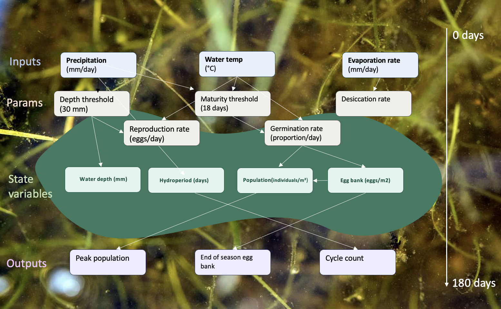

# How Climate Change Impacts Vernal Pool Fairy Shrimp

One of my most formative job experiences was at the Merced Vernal Pools and Grassland Reserve at UC Merced, where I developed a deep interest in fairy shrimp, small crustaceans that hatch and complete their life cycle during the wet season in vernal pools. During one particularly memorable wet season, I watched two full population cycles unfold over just a couple of months, which sparked a lasting question: how might climate change reshape these dynamics? Specifically, do shortened wet seasons leave fairy shrimp with insufficient time to reproduce before pools dry?

# Conceptual model

| Category | Variable | Definition | Units |
|------------------|------------------|------------------|------------------|
| **Input** | Precipitation | Daily precipitation, external climate forcing | mm/day, daily time series |
| **Input** | Water temperature | Controls development rate, reproduction, and adult mortality | °C, daily time series |
| **Input** | Evaporation rate | Physical water loss from pool surface | mm/day, daily time series |
| **Parameter** | Water depth threshold | Minimum depth (3 cm) required for inundation and reproduction | mm |
| **Parameter** | Maturity threshold | Minimum days inundated before reproduction begins (Helm 1988) | 18 days |
| **Parameter** | Reproduction rate | Rate of egg production per individual during inundation | eggs/individual/day |
| **Parameter** | Germination rate | Proportion of egg bank hatching per day when inundated | proportion/day |
| **Parameter** | Desiccation rate | Mortality rate when water depth falls below threshold | proportion of population/day |
| **state variable** | Water depth | Accumulates from precipitation, loses to evaporation | mm, daily time series |
| **state variable** | Hydroperiod | Cumulative days water depth exceeds threshold | days, accumulates each season |
| **state variable** | Population size | Active individuals during inundation | individuals/m², daily time series |
| **state variable** | Egg bank | Dormant cysts in soil, replenished by reproduction, depleted by germination and decay | eggs/m², daily time series |
| **Output** | Peak population size | Maximum population reached during inundation | individuals/m² |
| **Output** | End-of-season egg bank | Egg bank density at pool drying , indicates resilience to future drought | eggs/m² |
| **Output** | Cycle count | Number of complete generations per season | count per season |

\

## Model Overview

This model is a time-varying ordinary dynamic model simulating vernal pool fairy shrimp population dynamics. The entire model is run on 180 days to represent the wet season in Mediterranean climates. The model is structured around the external inputs that provide the foundation for fairy shrimp reproduction. These are the model inputs: precipitation, water temperature, and evaporation rate. Daily precipitation increments fill the pool, once the pool meets a minimum water depth threshold and holds that level for 18 days, the reproduction cycle can begin. The number of consecutive days above this threshold represent the hydroperiod. After the 18 day maturity threshold, then fairy shrimp begin to hatch and reproduce, depositing eggs into the egg bank. The adult reproductive population's survival depends on the evaporation rate not depleting the water depth threshold. If water depth depletes, then desiccation rate is applied to the model. The three outputs fo the model are quantified after the season. Peak population size represents the maximum population during inundation. End of season egg bank density is how much the egg bank changed during the season and represents the longevity of the fairy shrimp population. Cycle counts happen when pool inundation depletes and replenishes during a season.

## Model Assumptions

-   Wet season is around 180 days.

-   Since vernal pools occur on clay hardpan soil, it is safe to assume all water loss is through evaporation and not infiltration.

-   All precipitation increments accumulated across a region are considered to have applied to the pool.

-   If a pool's water depth goes below the threshold depth, the pool is assumed to be dry and the hydroperiod resets. If the previous inundation did not reach the 18-day maturity threshold then no reproduction cycle occurred.

-   There are no distinctions between juvenile and adult fairy shrimp.

-   Predation is not considered for this model, only desiccation is a form of mortality for fairy shrimp.

# Model use

In order to answer the question, "How can shortened wet season influence fairy shrimp population dynamics?"

### Model scenarios

In order to answer this question I would run a set of hydroperiod scenarios where I manipulate the precipitation input.

1.  Model scenario 1: A moderately shortened reduction in inundation length (90 days)
2.  Model scenario 2: A large reduction in inundation length. (30 days)
3.  Model scenario 3: Sporadic wet season with multiple cycles that are shortened moderately (3 × 25-day pulses with 15-day dry gaps)
4.  Model scenario 4: Wet season where pools never reach the 18 day minimum of inundation.

Then I would see the impact on my three outputs – end of season egg bank density, cycle count, and peak population size.

### Uncertainty Analysis

Since I am already aware about the importance of precipitation and water temperature on fairy shrimp populations, I would perform an uncertainty analysis on the following variables:

-   maturity threshold - since this number of days controls how the rest of the model works, I would like to see its influence in this model system. I would range this threshold between 14 and 25 days according to Helm 1988 on a uniform distrution since literature shows most data is not normal.

-   desiccation rate - this value influences how long adult shrimp can reproduce and is worth performing an analysis on to determine its effect. I would range this value on a beta distribution since the values range between 0 and 1, with mean and standard deviation derived from literature.

-   germination rate - this value controls how well eggs become reproducing adults and the time between hatching to reproduction is key, especially when combined with shortened wet seasons. I would range this value on a beta distribution.

## Visualizing sensitivity analysis

In order to visualize the results of the sensitivity analysis I would create box plots for each parameter and scatter plots to see the trends between each parameter value and their associated output. For instance, germination rate influenced egg bank.

## Model evaluation

In order to evaluate the accuracy of this model, I would utilize real data from the Merced Vernal Pools Reserve. My metric would be the RMSE between observe and modeled fairy shrimp population density as well as recordings of water depth during the survey period.
